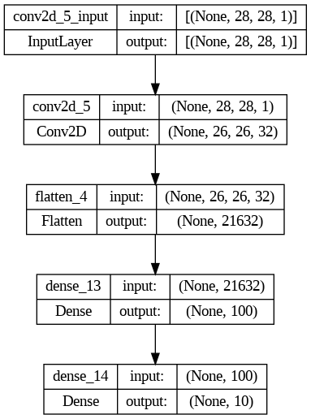

# Fashion-MNIST-Classification


## Dataset

The Dataset is already available with Keras. It can be loaded as follows:<br>

```
fashion_mnist = keras.datasets.fashion_mnist
(X_train_full, y_train_full), (X_test, y_test) = fashion_mnist.load_data()
```

## Model Overview
Model Architecture --><br><br>

